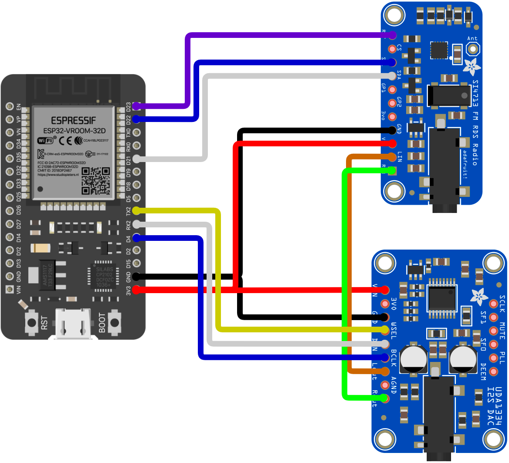

# FM Streamer

Gibt es in deiner Umgebung keine guten FM-Radiosender? Hast du dir schon einmal gewünscht, deinen Heimatsender auf deinem FM-Radio empfangen zu können, während du unterwegs bist? Dann ist dieses Projekt genau das Richtige für dich!

Dies ist ein einfaches ESP32/ESP8266-Projekt, das einen MP3-Internetstream empfängt und an einen FM-Sender weiterleitet, sodass du den Stream auf deinem klassischen FM-Radio hören kannst.

# Einrichtung

Falls du Linux oder macOS (oder ein anderes System mit installiertem GNU Make) verwendest, installiere [arduino-cli](https://github.com/arduino/arduino-cli). Dieses Projekt ist dafür konfiguriert, direkt mit arduino-cli zu arbeiten, was dir die Einrichtung des ESP32/ESP8266 und der benötigten Bibliotheken in der Arduino IDE erspart.

1. Führe `make config-tools` aus, um die Bibliotheken und den ESP32/ESP8266-Core zu installieren.
2. Benenne `arduino_secrets.h.example` in `arduino_secrets.h` um und trage darin die SSID und das Passwort deines WLANs ein.
3. Falls du die Radiostreams ändern möchtest, bearbeite sie in der `StationList`-Struktur in `fm-streamer.ino`.
4. Schalte dein Board ein, verbinde dessen serielle Schnittstelle mit deinem Computer und finde heraus, wie die serielle Schnittstelle auf deinem Computer angezeigt wird (z. B. `/dev/cu.usbserial-xxxx` oder `COM1`, etc.). Du benötigst diesen Wert für den nächsten Schritt.
5. Führe `make program SERIAL_PORT=<serialport> MCU_TYPE=<esp32|esp8266>` aus (ersetze `<serialport>` durch den Namen der seriellen Schnittstelle aus dem vorherigen Schritt und wähle entweder "esp32" oder "esp8266" als MCU_TYPE), um den Code zu kompilieren und auf dein Board hochzuladen.

# Nutzung

Sobald die oben genannten Schritte abgeschlossen und dein Board programmiert ist, verbindet sich der FM Streamer mit deinem WLAN, beginnt mit dem Streaming des ersten MP3-Streams aus der `StationList` (definiert in `webserver.h`) und sendet automatisch über FM. Es gibt eine Statusausgabe auf der seriellen Konsole, die anzeigt, was auf dem Board passiert.

Ein Webinterface ermöglicht die Steuerung des Senders, der Lautstärke und der Sendeleistung des FM Streamers. Beachte, dass dies auf dem ESP8266 nicht funktioniert, da dieser nicht über genug RAM für den Webserver und das Audiostreaming verfügt. Auf dem ESP32 funktioniert es jedoch gut. So sieht es aus:

---

# Technik

Dieses Projekt besteht aus drei Hardware-Komponenten:
1. [ESP32 Dev Board](https://www.amazon.com/dp/B08D5ZD528) oder [ESP8266 NodeMCU v1.0](https://www.amazon.com/gp/product/B010O1G1ES/)
2. [Adafruit UDA1334A I2S Stereo DAC Breakout Board](https://www.adafruit.com/product/3678)
3. [Adafruit Si4713 FM Transmitter Breakout Board](https://www.adafruit.com/product/1958)

## Hardware

Diese werden wie folgt miteinander verbunden (für den ESP32):

Alles wird vom 3,3V-Ausgang des ESP32-Boards mit Strom versorgt. Der Si4713-FM-Sender ist über I2C mit dem ESP32 verbunden, der UDA1334-DAC ist über I2S verbunden, und der UDA1334-DAC gibt Audio über analoge Stereoausgänge an den Si4713-Sender weiter.

Ich habe auch einen 4,7kΩ-Widerstand von jedem der analogen Audioausgänge des DACs nach GND geschaltet, um eine leichte Last für den DAC zu schaffen. Dies hat geholfen, Rauschen und Clipping am Eingang des FM-Senders zu reduzieren, obwohl ich nicht viel mit den Werten experimentiert habe, um herauszufinden, ob dies wirklich notwendig ist.

## Software

Die Software nutzt die [ESP8266Audio](https://github.com/earlephilhower/ESP8266Audio)-Bibliothek und den [Adafruit Si4713](https://github.com/adafruit/Adafruit-Si4713-Library)-Treiber. Der Webserver verwendet die [ESPAsyncWebServer](https://github.com/me-no-dev/ESPAsyncWebServer/)-Bibliothek.

